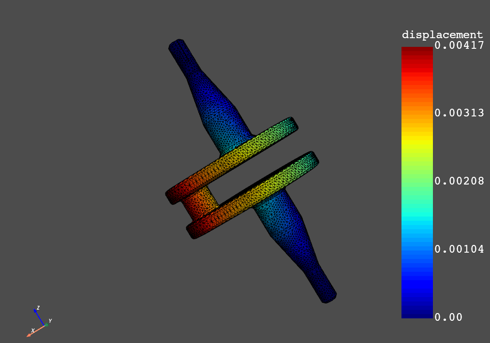

.. _ref_getting_started:

===============
Getting started
===============

The Data Processing Framework (DPF) provides numerical simulation users and engineers with a toolbox
for accessing and transforming simulation data. DPF can access data from Ansys solver
result files as well as from several neutral file formats. For more information, see :ref:`ref_main_index`.

This **workflow-based** framework allows you to perform complex preprocessing and
postprocessing operations on large amounts of simulation data.

PyDPF-Core is a Python client API communicating with a **DPF Server**, either
through the network using gRPC or directly in the same process.

Install DPF Server
------------------

To use PyDPF-Core, you need access to a DPF Server.

* DPF Server is packaged within the **Ansys installer** in Ansys 2021 R1 and later.
  To use it, download the standard installation using your preferred distribution channel,
  and install Ansys following the installer instructions.
  For information on getting a licensed copy of Ansys, visit the `Ansys website <https://www.ansys.com/>`_.

* DPF Server pre-releases are also available as **standalone** packages (independent of the Ansys installer) on the
  `DPF Pre-Release page <https://download.ansys.com/Others/DPF%20Pre-Release>`_ of the Ansys Customer Portal.
  As explained in :ref:`ref_licensing`, the standalone DPF Server is still protected by an Ansys license mechanism
  and requires accepting the :ref:`DPF Preview License Agreement<target_to_license_terms>`.
  Once you have access to an Ansys license, follow the guidelines to :ref:`install a standalone DPF Server <target_installing_server>`.

For more information regarding installing, managing, and running DPF servers, see :ref:`ref_dpf_server`.

Install PyDPF-Core
------------------

To install PyDPF-Core, in a Python environment, run this command:

.. code::

   pip install ansys-dpf-core

Be sure to check the :ref:`compatibility guidelines <ref_compatibility>` to know if your
DPF Server version is compatible with the latest version of PyDPF-Core.

For more installation options, see :ref:`Installation section <installation>`.

Use PyDPF-Core
--------------

To use PyDPF-Core, in the same Python environment, run this command:

.. code-block:: python

    from ansys.dpf import core as dpf
    from ansys.dpf.core import examples
    model = dpf.Model(examples.download_crankshaft())
    print(model)

.. rst-class:: sphx-glr-script-out

 .. code-block:: none

    DPF Model
    ------------------------------
    Static analysis
    Unit system: MKS: m, kg, N, s, V, A, degC
    Physics Type: Mechanical
    Available results:
         -  displacement: Nodal Displacement
         -  velocity: Nodal Velocity
         -  acceleration: Nodal Acceleration
         -  reaction_force: Nodal Force
         -  stress: ElementalNodal Stress
         -  elemental_volume: Elemental Volume
         -  stiffness_matrix_energy: Elemental Energy-stiffness matrix
         -  artificial_hourglass_energy: Elemental Hourglass Energy
         -  thermal_dissipation_energy: Elemental thermal dissipation energy
         -  kinetic_energy: Elemental Kinetic Energy
         -  co_energy: Elemental co-energy
         -  incremental_energy: Elemental incremental energy
         -  elastic_strain: ElementalNodal Strain
         -  structural_temperature: ElementalNodal Temperature
    ------------------------------
    DPF  Meshed Region:
      69762 nodes
      39315 elements
      Unit: m
      With solid (3D) elements
    ------------------------------
    DPF  Time/Freq Support:
      Number of sets: 3
    Cumulative     Time (s)       LoadStep       Substep
    1              1.000000       1              1
    2              2.000000       1              2
    3              3.000000       1              3

.. code-block:: python

    over_time_disp = model.results.displacement().eval()
    over_time_disp[0].plot()

.. toctree::
   :maxdepth: 2
   :hidden:

   install
   dpf_server
   compatibility
   licensing
   dependencies
   contributing

