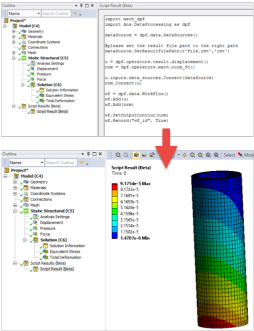

.. _user_guide_waysofusing:

========================================
DPF capabilities and scripting languages
========================================
DPF is a framework that provides data computation capabilities. 

DPF as a framework
------------------

DPF application: kernel and operator libraries
~~~~~~~~~~~~~~~~~~~~~~~~~~~~~~~~~~~~~~~~~~~~~~

DPF capabilities are provided through libraries of operators. 
To learn more about the computed data and the operator concepts, see :ref:`user_guide_concepts`.

A DPF application is always composed of a kernel (DataProcessingCore and DPFClientAPI binaries),
that enables capabilities by loading libraries of operators (for example, mapdlOperatorsCore library
is basic library enabled by DPF).
This application is also called a **DPF Server application**.

When starting a DPF application, you can customize the list of the libraries that the kernel loads.
To learn more on how to customize the initialization of a DPF application, see :ref:`user_guide_xmlfiles`.

DPF client: available APIs and languages
~~~~~~~~~~~~~~~~~~~~~~~~~~~~~~~~~~~~~~~~

DPF capabilities are enabled using the DPF Server application.
These capabilities can be accessed through client APIs, as shown here:

.. image:: ../../images/drawings/apis_2.png

1. The DPF server application can be accessed using an Ansys product, or DPF Server package (see :ref:`ref_dpf_server`) available on the Customer portal.

2. Several client APIs are available (CPython, IronPython, C++, and so on).

3. Communication in the same process, or through gRPC, allows you to have the client and the servers on different machines.

Note that **IronPython and CPython APIs are different**, each has specific syntax.

The **list of available operators when using DPF is independent from the language or API which is used**. It depends only
on how the DPF application has been initialized.

Most of the DPF capabilities can be accessed using the operators. For more information about the existing operators, see :ref:`ref_dpf_operators_reference`.

Enhance DPF capabilities
~~~~~~~~~~~~~~~~~~~~~~~~

The available DPF capabilities loaded in a DPF application can be enhanced by creating new operator libraries.
DPF offers multiple development APIs depending on your environment. These plugins can be:

- CPython based (see :ref:`user_guide_custom_operators`)

- C++ based (see "DPF/USER GUIDE" section of `C++ documentation <https://developer.ansys.com/docs>`_)

DPF integration
---------------
DPF is available as a standalone tool and as a tool in Ansys Mechanical. You should decide whether you want
to use standalone DPF or DPF in Mechanical before creating any scripts.

DPF as a standalone application
~~~~~~~~~~~~~~~~~~~~~~~~~~~~~~~

**Standalone DPF** can be used through any of the previously mentioned APIs.

In particular, DPF Standalone capabilities can be enabled using **CPython** and can be accessed via any Python console.
Data can be exported to universal file formats, such as VTK, HDF5, and TXT
files. You can use it to generate TH-plots, screenshots, and animations or
to create custom result plots using the `numpy <https://numpy.org/>`_
and `matplotlib <https://matplotlib.org/>`_ packages.

.. image:: ../../images/drawings/dpf-reports.png

Mechanical
~~~~~~~~~~
**DPF in Mechanical** uses IronPython and is accessible with the **ACT Console**.
Use it to perform custom postprocessing and visualization of results directly 
within the Mechanical application.

