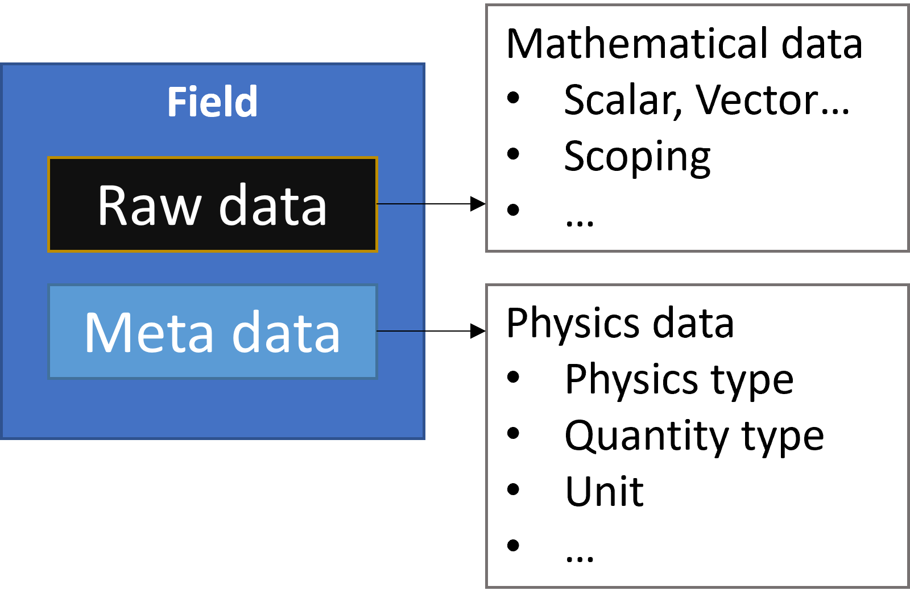

.. _ref_user_guide_fields_container:

============================
Fields containers and fields
============================
While DPF uses operators to load and operate on data, it uses fields containers
and fields to store and return data. Operators are like verbs, acting on the data, 
while fields containers and fields are like nouns, objects that hold data.  

Access a fields container or field
-----------------------------------
The outputs from operators can be either a 
:class:`ansys.dpf.core.fields_container.FieldsContainer` or 
:class:`ansys.dpf.core.field.Field` class.

A fields container is the DPF equivalent of a list of fields. It holds a
vector of fields.

This example uses the ``elastic_strain`` operator to access a fields container:

.. code-block::

    from ansys.dpf import core as dpf
    from ansys.dpf.core import examples
    model = dpf.Model(examples.find_msup_transient())
    epel = model.results.elastic_strain.on_all_time_freqs
    fields = epel.eval()
    print(fields)
    
.. rst-class:: sphx-glr-script-out

 .. code-block:: none
 
    DPF elastic_strain(s)Fields Container
      with 20 field(s)
      defined on labels: time 
    
      with:
      - field 0 {time:  1} with ElementalNodal location, 6 components and 40 entities.
      - field 1 {time:  2} with ElementalNodal location, 6 components and 40 entities.
      - field 2 {time:  3} with ElementalNodal location, 6 components and 40 entities.
      - field 3 {time:  4} with ElementalNodal location, 6 components and 40 entities.
      - field 4 {time:  5} with ElementalNodal location, 6 components and 40 entities.
      - field 5 {time:  6} with ElementalNodal location, 6 components and 40 entities.
      - field 6 {time:  7} with ElementalNodal location, 6 components and 40 entities.
      - field 7 {time:  8} with ElementalNodal location, 6 components and 40 entities.
      - field 8 {time:  9} with ElementalNodal location, 6 components and 40 entities.
      - field 9 {time:  10} with ElementalNodal location, 6 components and 40 entities.
      - field 10 {time:  11} with ElementalNodal location, 6 components and 40 entities.
      - field 11 {time:  12} with ElementalNodal location, 6 components and 40 entities.
      - field 12 {time:  13} with ElementalNodal location, 6 components and 40 entities.
      - field 13 {time:  14} with ElementalNodal location, 6 components and 40 entities.
      - field 14 {time:  15} with ElementalNodal location, 6 components and 40 entities.
      - field 15 {time:  16} with ElementalNodal location, 6 components and 40 entities.
      - field 16 {time:  17} with ElementalNodal location, 6 components and 40 entities.
      - field 17 {time:  18} with ElementalNodal location, 6 components and 40 entities.
      - field 18 {time:  19} with ElementalNodal location, 6 components and 40 entities.
      - field 19 {time:  20} with ElementalNodal location, 6 components and 40 entities.

Access fields within a fields container
---------------------------------------
Many methods are available for accessing a field in a field
container. The preceding results contain a transient
result, which means that the fields container has one field
by time set. 

Access the field:

.. code-block::

    len(fields)

.. rst-class:: sphx-glr-script-out

 .. code-block:: none
 
    20
    
Access the field based on its index:

.. code-block::

    field_first_time = fields[0]
    field_last_time = fields[19]

Access the field based on its time set ID:

.. code-block::

    field = fields.get_field_by_time_id(1)

To access fields for more complex requests, you can use the 
``get_field()`` method with the ID of the requested field:

.. code-block::
    
    field = fields.get_field({'time': 1})
    print(field)
    
.. rst-class:: sphx-glr-script-out

 .. code-block:: none
 
     DPF elastic_strain_0.01s Field
     Location: ElementalNodal
     Unit:
     40 entities
     Data: 6 components and 320 elementary data
     Elemental
     IDs                   data ()
     ------------         ----------
     21                   -5.0964e-07   -5.8226e-07    1.8660e-06    8.3252e-09   -3.3062e-09   -7.7246e-08
                          -5.7021e-07   -5.7104e-07    1.8996e-06   -9.9354e-10   -3.4486e-08   -7.4886e-08
                          -6.0495e-07   -6.0408e-07    2.0172e-06    4.9817e-09   -5.5109e-09   -2.1038e-08
                       ...
     22                   -5.0964e-07   -5.8226e-07    1.8660e-06   -8.3252e-09   -3.3062e-09    7.7246e-08
                          -5.6697e-07   -6.1112e-07    1.9950e-06    4.0239e-09    1.0457e-09    1.9740e-08
                          -6.0495e-07   -6.0408e-07    2.0172e-06   -4.9817e-09   -5.5109e-09    2.1038e-08
                       ...
     23                   -3.7887e-07   -4.8075e-07    1.4980e-06    9.6495e-09   -1.1785e-08   -1.6389e-07
                          -4.6401e-07   -4.6508e-07    1.5451e-06    1.6581e-09   -7.7990e-08   -1.5638e-07
                          -5.7202e-07   -5.7104e-07    1.9081e-06    4.9200e-09   -3.3430e-08   -8.2869e-08
                       ...
     ...

      
Here is a more real-world example:

.. code-block::

    model = dpf.Model(examples.download_all_kinds_of_complexity())
    epel = model.results.elastic_strain.on_all_time_freqs.split_by_shape
    fields = epel.eval()
    field = fields.get_field({'time': 1, 'elshape':0})
    print(field)
    
    field = fields.get_field({'time': 1, 'elshape':1})
    print(field)

.. rst-class:: sphx-glr-script-out

 .. code-block:: none
 
     DPF elastic_strain_1.s_elshape:0 Field
     Location: ElementalNodal
     Unit:
     203 entities
     Data: 6 components and 2436 elementary data
     Elemental
     IDs                   data ()
     ------------          ----------
     10791                  9.961283e-05   -1.557876e-05   -6.798322e-05    4.423883e-20    7.823432e-21    4.348549e-06
                            9.532236e-05   -1.426944e-05   -6.635107e-05    4.234001e-20    1.050099e-20    1.901931e-05
                            8.607592e-05   -3.046389e-05   -2.422499e-05    3.823384e-20    1.776519e-20    1.917663e-05
                        ...
     10790                  9.829979e-05   -8.944115e-06   -8.014052e-05   -5.813971e-21    3.947791e-20    2.315096e-05
                            9.230295e-05   -1.569666e-05   -6.043398e-05   -6.588927e-21    3.371362e-20    2.682668e-05
                            1.068346e-04   -1.988030e-05   -6.647159e-05   -6.227784e-21    3.825956e-20    2.475124e-05
                        ...
     10785                  8.480231e-05   -1.470483e-05   -5.494706e-05    2.105046e-21    3.093755e-20   -9.940667e-06
                            7.555470e-05   -2.958404e-05   -1.549013e-05    2.273083e-21    2.002334e-20   -1.064724e-05
                            7.552039e-05   -2.970292e-05   -1.521445e-05    4.916594e-21    1.996089e-20   -2.255241e-05
                        ...
     ...
     DPF elastic_strain_1.s_elshape:1 Field
     Location: ElementalNodal
     Unit:
     9052 entities
     Data: 6 components and 37580 elementary data
     Elemental
     IDs                   data ()
     ------------          ----------
     1                     -2.365747e-04    8.205943e-04   -2.195325e-04    4.799285e-04    2.372855e-04   -8.473678e-06
                           -5.085632e-04    1.070203e-03   -2.770476e-04   -2.848311e-04    3.473931e-04    4.251066e-06
                           -4.331823e-04    9.600782e-04   -4.320994e-04   -3.780877e-04   -3.978023e-04   -2.898742e-06
                        ...
     8                     -2.388557e-04    8.369775e-04   -2.127467e-04    4.718478e-04    1.823031e-04   -5.630592e-06
                           -2.600095e-04    7.688167e-04   -1.320574e-04    5.460561e-04    8.167552e-05   -7.558865e-06
                           -5.470272e-04    9.995268e-04   -1.715976e-04   -3.155533e-04    1.211339e-04   -1.600466e-06
                        ...
     15                    -2.588085e-04    7.750597e-04   -1.346239e-04    5.428307e-04    6.121315e-05   -6.311711e-06
                           -2.671824e-04    7.798763e-04   -1.107667e-04    5.587949e-04   -2.850134e-05    1.501269e-06
                           -5.611221e-04    1.008660e-03   -1.391484e-04   -3.172989e-04   -2.487912e-05    1.011503e-07
                        ...
     ...

 

The following example references the available time frequency support to determine which
time complex IDs are available in the fields container:

.. code-block::

    model = dpf.Model(examples.find_msup_transient())
    epel = model.results.elastic_strain.on_all_time_freqs
    fields = epel.eval()
    print(fields.time_freq_support)

.. rst-class:: sphx-glr-script-out

 .. code-block:: none
 
    DPF  Time/Freq Support: 
      Number of sets: 20 
    Cumulative     Time (s)       LoadStep       Substep         
    1              0.010000       1              1               
    2              0.020000       1              2               
    3              0.030000       1              3               
    4              0.040000       1              4               
    5              0.050000       1              5               
    6              0.060000       1              6               
    7              0.070000       1              7               
    8              0.080000       1              8               
    9              0.090000       1              9               
    10             0.100000       1              10              
    11             0.110000       1              11              
    12             0.120000       1              12              
    13             0.130000       1              13              
    14             0.140000       1              14              
    15             0.150000       1              15              
    16             0.160000       1              16              
    17             0.170000       1              17              
    18             0.180000       1              18              
    19             0.190000       1              19              
    20             0.200000       1              20              

Note that the time set IDs used are one-based. When indexing from Pythonic 
indexing with ``fields[0]``, you can use zero-based indexing. When using
the ``get_fields()`` method to access results, you should base the request on
time-scoping set IDs.

Field data
----------
The :class:`ansys.dpf.core.field.Field` class is the fundamental unit of data within DPF.
It contains the actual data and its metadata, which is results data defined by values 
associated with entities (scoping). These entities are a subset of a model (support). 

In DPF, field data is always associated with its scoping and support, making the field 
a self-describing piece of data. A field is also defined by other attributes, including
dimensionality, unit, and location.

You can get an overview of a field's metadata by printing the field:

.. code-block::

    field = fields[0]
    print(field)

.. rst-class:: sphx-glr-script-out

 .. code-block:: none
 
   DPF elastic_strain_0.01s Field
   Location: ElementalNodal
   Unit:
   40 entities
   Data: 6 components and 320 elementary data
   Elemental
   IDs                   data ()
   ------------          ----------
   21                    -5.096470e-07   -5.822648e-07    1.866023e-06    8.325266e-09   -3.306256e-09   -7.724631e-08
                         -5.702127e-07   -5.710485e-07    1.899680e-06   -9.935434e-10   -3.448644e-08   -7.488671e-08
                         -6.049504e-07   -6.040822e-07    2.017216e-06    4.981728e-09   -5.510947e-09   -2.103890e-08
                      ...
   22                    -5.096470e-07   -5.822648e-07    1.866023e-06   -8.325266e-09   -3.306259e-09    7.724629e-08
                         -5.669729e-07   -6.111289e-07    1.995080e-06    4.023948e-09    1.045763e-09    1.974096e-08
                         -6.049504e-07   -6.040822e-07    2.017216e-06   -4.981728e-09   -5.510943e-09    2.103889e-08
                      ...
   23                    -3.788760e-07   -4.807594e-07    1.498000e-06    9.649583e-09   -1.178512e-08   -1.638991e-07
                         -4.640120e-07   -4.650817e-07    1.545128e-06    1.658194e-09   -7.799093e-08   -1.563803e-07
                         -5.720271e-07   -5.710485e-07    1.908120e-06    4.920075e-09   -3.343032e-08   -8.286970e-08
                      ...
   ...

The next section provides an overview of the metadata associated with the field itself.

Field metadata
--------------
A field contains the metadata for the result it is associated with. The metadata 
includes the location (such as ``Elemental``, ``Nodal``, or
``ElementalNodal``) and the IDs associated with the location.

The field's scoping defines the order of the data, for example: the first ID in the
``scoping`` identifies to which entity the first ``entity data`` in the data vector belongs.

To access the scoping of the field, use the ``scoping`` attribute:

.. code-block:: python

    print(field.scoping)
    print('field.scoping.ids:', field.scoping.ids)
    print('field.location:', field.location)

.. rst-class:: sphx-glr-script-out

 .. code-block:: none
 
    DPF scoping: 
      with Elemental location and 40 entities

   field.scoping.ids: [21,
     22,
     23,
     24,
     25,
     26,
     ...
     ]
     
     field.location:'ElementalNodal'

- The ``Elemental`` location denotes one value of data (multiplied by the number
  of components) per element.
- The ``Nodal`` location is one value per node.
- The ``ElementalNodal`` location is one value per node per element. For example,
  strain is an ``ElementalNodal`` value because strain is evaluated at each node
  for each element.

The field also contains metadata, including the shape of
the data stored, location of the field, number of components, and
units of the data:

    
.. code-block:: python

    stress = model.results.stress
    field = stress.eval()[0]

    # Units of the field describing volume
    field.unit
    
    #Location of the field (Elemental, ElementalNodal, or Nodal)
    field.location

    # Number of components associated with the field. It's expected to
    # be a single dimension because there can only be one volume per
    # element.
    field.component_count

.. rst-class:: sphx-glr-script-out

 .. code-block:: none
 
     'Pa'
     'ElementalNodal'
     6

Access field data
-----------------
When DPF-Core returns the :class:`ansys.dpf.core.field.Field` class, 
what Python actually has is a client-side representation of the field, 
not the entirety of the field itself. This means that all the data of
the field is stored within the DPF service. This is important because
when building your postprocessing workflows, the most efficient way of 
interacting with result data is to minimize the exchange of data between 
Python and DPF, either by using operators or by accessing only the data 
that is needed.

The field's ``data`` is ordered with respect to its ``scoping ids`` (see above).
To access the entire array of data as a ``numpy`` array:

.. code-block:: python

    array = field.data
    print(array)

.. rst-class:: sphx-glr-script-out

 .. code-block:: none

    DPFArray([[ 4.01372930e+04,  3.85071930e+02, -1.40019130e+07,
            7.48472351e+02, -2.60259531e+04, -2.62856938e+05],
          [-1.19228638e+03, -6.18210815e+02, -1.39912700e+07,
            2.61468994e+03, -1.31871719e+05, -2.59527125e+05],
          [ 9.02558960e+02,  5.63793152e+02, -1.17102740e+07,
           -8.99381836e+02, -1.21302727e+05, -2.45666328e+05],
          ...,
          [-3.99694531e+04,  1.44622528e+02,  9.62343100e+06,
           -7.09812073e+02, -2.26106621e+04, -2.23155891e+05],
          [-4.31104401e+02, -2.67612732e+02,  9.60954800e+06,
            1.93208755e+02, -1.11580734e+05, -2.24406062e+05],
          [ 5.56899536e+02,  3.88515320e+02,  1.17119880e+07,
           -1.68983887e+03, -1.21768023e+05, -2.41346125e+05]])

This array has 6 components by elementary data (symmetrical tensor XX,YY,ZZ,XY,YZ,XZ).
Note that this array is a genuine, local, numpy array (overloaded by the DPFArray).

.. code-block:: python

    print(type(array))

.. rst-class:: sphx-glr-script-out

 .. code-block:: none

    <class 'ansys.dpf.gate.dpf_array.DPFArray'>

To access an individual node or element, request it
using either the ``get_entity_data()`` or ``get_entity_data_by_id()`` method:

Get the data from the first element in the field.

.. code-block:: python

    field.get_entity_data(0)

.. rst-class:: sphx-glr-script-out

 .. code-block:: none

    DPFArray([[ 4.01372930e+04,  3.85071930e+02, -1.40019130e+07,
                7.48472351e+02, -2.60259531e+04, -2.62856938e+05],
              [-1.19228638e+03, -6.18210815e+02, -1.39912700e+07,
                2.61468994e+03, -1.31871719e+05, -2.59527125e+05],
              [ 9.02558960e+02,  5.63793152e+02, -1.17102740e+07,
               -8.99381836e+02, -1.21302727e+05, -2.45666328e+05],
              [ 3.97351055e+04, -2.43928162e+02, -1.17250040e+07,
                6.08324829e+02, -2.46618770e+04, -2.43019891e+05],
              [-4.01372930e+04, -3.85071625e+02,  1.40019130e+07,
                7.48472534e+02, -2.60259531e+04,  2.62856938e+05],
              [ 1.19228601e+03,  6.18211121e+02,  1.39912700e+07,
                2.61468970e+03, -1.31871719e+05,  2.59527125e+05],
              [-9.02558777e+02, -5.63793701e+02,  1.17102740e+07,
               -8.99382568e+02, -1.21302727e+05,  2.45666328e+05],
              [-3.97351016e+04,  2.43927902e+02,  1.17250040e+07,
                6.08326172e+02, -2.46618770e+04,  2.43019891e+05]])

Get the data for the element with ID 10.

.. code-block:: python

    field.get_entity_data_by_id(10)

.. rst-class:: sphx-glr-script-out

 .. code-block:: none

    DPFArray([[ 4.99232031e+04,  1.93570602e+02, -3.08514075e+06,
           -5.48255615e+02, -1.37476562e+04,  1.34827719e+05],
          [ 5.23090469e+04, -1.87847885e+02, -1.98004588e+06,
           -1.12942969e+03, -1.11147285e+04,  1.09223398e+05],
          [-4.90510511e+00, -1.16425255e+02, -1.96296662e+06,
           -5.48878540e+02, -5.48524844e+04,  1.09255164e+05],
          [ 2.63994884e+01,  1.50431015e+02, -3.06906050e+06,
           -1.17046680e+03, -6.76924219e+04,  1.34773391e+05],
          [-4.99232031e+04, -1.93571167e+02,  3.08514075e+06,
           -5.48256836e+02, -1.37476562e+04, -1.34827719e+05],
          [-5.23090469e+04,  1.87848083e+02,  1.98004588e+06,
           -1.12943201e+03, -1.11147295e+04, -1.09223398e+05],
          [ 4.90471840e+00,  1.16423714e+02,  1.96296662e+06,
           -5.48877380e+02, -5.48524844e+04, -1.09255164e+05],
          [-2.63994102e+01, -1.50429443e+02,  3.06906050e+06,
           -1.17046619e+03, -6.76924219e+04, -1.34773391e+05]])

Note that this would correspond to an index of 29 within the
field. Be aware that scoping IDs are not sequential. You would
get the index of element 29 in the field with:

.. code-block:: python

    field.scoping.ids.index(10)

.. rst-class:: sphx-glr-script-out

 .. code-block:: none

    29
    
Here the data for the element with ID 10 is made of eight symmetrical tensors.
The elastic strain has one tensor value by node by element (ElementalNodal location)
    
To get the displacement on node 3, you would use:

.. code-block:: python

    disp = model.results.displacement.eval()[0]
    disp.get_entity_data_by_id(3)

.. rst-class:: sphx-glr-script-out

 .. code-block:: none

    DPFArray([[8.06571808e-14, 4.03580652e-04, 2.61804706e-05]])
    
One 3D vector (X,Y,Z) displacement

While these methods are acceptable when requesting data for a few elements
or nodes, they should not be used when looping over the entire array. For efficiency,
a field's data can be recovered locally before sending a large number of requests:

.. code-block:: python

    with field.as_local_field() as f:
        for i in range(1,100):
            f.get_entity_data_by_id(i)

Operate on field data
---------------------
Oftentimes, you do not need to directly act on the data of an array within
Python. For example, if you want to know the maximum of the data, you can
use the ``array.max()`` method to compute the maximum of the array with the
``numpy`` package. However, this requires sending the entire array to Python
and then computing the maximum there. Rather than copying the array over and
computing the maximum in Python, you can instead compute the maximum directly
from the field itself.

This example uses the ``min_max`` operator to compute the maximum of
the field while returning the field:

Compute the maximum of the field within DPF and return the result
in a numpy array

.. code-block:: python

    max_field = field.max()
    max_field.data

.. rst-class:: sphx-glr-script-out

 .. code-block:: none

    DPFArray([22083762.  , 22406040.  , 52603044.  ,  1623704.25,  2443320.75,
           5014283.5 ])

Get the element or node ID of the maximum value.

.. code-block:: python

    max_field.scoping.ids

.. rst-class:: sphx-glr-script-out

 .. code-block:: none

    DPFArray([39, 39, 39, 40, 39, 39])

This example uses the ``elemental_mean`` operator to compute the 
average of a field:

.. code-block:: python

    from ansys.dpf.core import operators as ops
    avg_op = ops.averaging.elemental_mean(field)
    avg_field = avg_op.outputs.field()
    print(avg_field.get_entity_data(0))
    print(avg_field.location)

.. rst-class:: sphx-glr-script-out

 .. code-block:: none
 
    [[ 4.65393066e-04 -2.47955322e-05  0.00000000e+00  7.68026390e+02
      -7.59655688e+04  0.00000000e+00]]  
    Elemental
    
For comprehensive information on chaining operators, see :ref:`ref_user_guide_operators`.  

API reference
-------------
For more information, see :py:mod:`FieldsContainer <ansys.dpf.core.fields_container>` and
:py:mod:`Field <ansys.dpf.core.field>` in the **API reference**.
