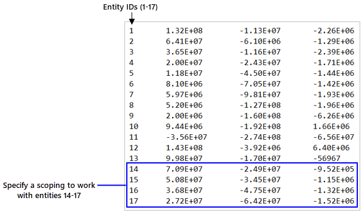

.. _reft_tutorials_narrow_down_data:

================
Narrow down data
================

:bdg-mapdl:`MAPDL` :bdg-lsdyna:`LS-DYNA` :bdg-fluent:`FLUENT` :bdg-cfx:`CFX`

.. include:: ../../../links_and_refs.rst
.. |location| replace:: :class:`location<ansys.dpf.core.common.locations>`
.. |time_freq_scoping_factory| replace:: :mod:`time_freq_scoping_factory<ansys.dpf.core.time_freq_scoping_factory>`
.. |mesh_scoping_factory| replace:: :mod:`mesh_scoping_factory<ansys.dpf.core.mesh_scoping_factory>`
.. |displacement| replace:: :class:`result.displacement <ansys.dpf.core.operators.result.displacement.displacement>`
.. |Model.results| replace:: :func:`Model.results <ansys.dpf.core.model.Model.results>`
.. |result op| replace:: :mod:`result<ansys.dpf.core.operators.result>`
.. |rescope| replace:: :class:`rescope <ansys.dpf.core.operators.scoping.rescope.rescope>`
.. |from_mesh| replace:: :class:`from_mesh <ansys.dpf.core.operators.scoping.from_mesh.from_mesh>`
.. |extract_scoping| replace:: :class:`extract_scoping <ansys.dpf.core.operators.utility.extract_scoping.extract_scoping>`
.. |scoping_by_sets| replace:: :func:`scoping_by_sets() <ansys.dpf.core.time_freq_scoping_factory.scoping_by_sets>`
.. |nodal_scoping| replace:: :func:`nodal_scoping() <ansys.dpf.core.mesh_scoping_factory.nodal_scoping>`
.. |ScopingsContainer| replace:: :class:`ScopingsContainer <ansys.dpf.core.scopings_container.ScopingsContainer>`

This tutorial explains how to scope your results over time and mesh domains.

:jupyter-download-script:`Download tutorial as Python script<narrow_down_data>`
:jupyter-download-notebook:`Download tutorial as Jupyter notebook<narrow_down_data>`

Understanding the scope
-----------------------

To begin the workflow set up, you need to establish the ``scoping``, that is
a spatial and/or temporal subset of the simulation data.

The data in DPF is represented by a |Field|. Thus, narrow down your results means scoping your |Field|.
To do so in DPF, you use the |Scoping| object. You can retrieve all the time steps available for
a result, but you can also filter them.

.. note::

    Scoping is important because when DPF-Core returns the |Field| object, what Python actually has
    is a client-side representation of the |Field|, not the entirety of the |Field| itself. This means
    that all the data of the field is stored within the DPF service. This is important
    because when building your workflows, the most efficient way of interacting with result data
    is to minimize the exchange of data between Python and DPF, either by using operators
    or by accessing exclusively the data that is needed. For more information on the DPF data storage
    structures see :ref:`ref_tutorials_data_structures`.

In conclusion, the essence of a scoping is to specify a set of time or mesh entities by defining a range of IDs:

Create a |Scoping| object from scratch
--------------------------------------

The |Scoping| object can be created by:

- :ref:`Instantiating the Scoping class<ref_create_scoping_instance_object>`;
- :ref:`Using the scoping factory <ref_create_scoping_scoping_factory>`.

.. jupyter-execute::

    # Import the ``ansys.dpf.core`` module
    from ansys.dpf import core as dpf

.. _ref_create_scoping_instance_object:

Instanciate a |Scoping|
^^^^^^^^^^^^^^^^^^^^^^^

Create a time and a mesh scoping by instantiating the |Scoping| object. Use the *'ids'* and *'location'* arguments
and give the entities ids and |location| of interest.

- Time scoping

A time location in DPF is a |TimeFreqSupport| object. Thus, we chose a *'time_freq'* |location| and target
a set of time by their ids.

.. jupyter-execute::

    # Define a time list that targets the times ids 14, 15, 16, 17
    time_list_1 = [14, 15, 16, 17]

    # Create the time Scoping object
    time_scoping_1 = dpf.Scoping(ids=time_list_1, location=dpf.locations.time_freq)

- Mesh scoping

Here, we chose a nodal |location| and target a set of nodes by their ids.

.. jupyter-execute::

    # Define a nodes list that targets the nodes with the ids 103, 204, 334, 1802
    nodes_ids_1 = [103, 204, 334, 1802]

    #  Create the mesh Scoping object
    mesh_scoping_1 = dpf.Scoping(ids=nodes_ids_1, location=dpf.locations.nodal)

.. _ref_create_scoping_scoping_factory:

Use the scoping factory module
^^^^^^^^^^^^^^^^^^^^^^^^^^^^^^

Create a |Scoping| object by using the |time_freq_scoping_factory| module for a temporal scoping
and the |mesh_scoping_factory| module for a spatial scoping.

- Time scoping

Here, we use the |scoping_by_sets| function so we can have different time steps in the scoping. This function
gives a Scoping on a *'time_freq'* |location|.

.. jupyter-execute::

    # Define a time list that targets the times ids 14, 15, 16, 17
    time_list_2 = [14, 15, 16, 17]

    # Create the time Scoping object
    time_scoping_2 = dpf.time_freq_scoping_factory.scoping_by_sets(cumulative_sets=time_list_2)

- Mesh scoping

Here, we use the |nodal_scoping| function so we have a mesh scoping in a nodal |location|.

.. jupyter-execute::

    # Define a nodes list that targets the nodes with the ids 103, 204, 334, 1802
    nodes_ids_2 = [103, 204, 334, 1802]

    # Create the mesh Scoping object
    mesh_scoping_2 = dpf.mesh_scoping_factory.nodal_scoping(node_ids=nodes_ids_2)

Extract a |Scoping|
-------------------

You can extract a mesh |Scoping| from some DPF objects. They are:

- A |MeshedRegion|;
- A |FieldsContainer| ;
- A |Field|.

Define the objects
^^^^^^^^^^^^^^^^^^

First, import a result file. For this tutorial, you can use one available in the |Examples| module.
For more information about how to import your own result file in DPF, see the :ref:`ref_tutorials_import_result_file`
tutorial.

From this result file we extract:

- The mesh, once in DPF a mesh is a |MeshedRegion| object;
- The displacement results. The displacement |Result| object gives a |FieldsContainer| when evaluated. Additionally,
  we can get a |Field| from this |FieldsContainer|.

.. jupyter-execute::

    # Import the ``ansys.dpf.core`` module
    from ansys.dpf import core as dpf
    # Import the examples module
    from ansys.dpf.core import examples
    # Import the operators module
    from ansys.dpf.core import operators as ops

    # Define the result file path
    result_file_path_1 = examples.download_transient_result()
    # Create the DataSources object
    ds_1 = dpf.DataSources(result_path=result_file_path_1)
    # Create the model
    model_1 = dpf.Model(data_sources=ds_1)

    # Get the MeshedRegion
    meshed_region_1 = model_1.metadata.meshed_region

    # Get a FieldsContainer with the displacement results
    fc = model_1.results.displacement.on_all_time_freqs.eval()

    # Get a Field from the FieldsContainer
    field = fc[0]

Extract the mesh |Scoping|
^^^^^^^^^^^^^^^^^^^^^^^^^^

- From the |MeshedRegion|
~~~~~~~~~~~~~~~~~~~~~~~~~

Extract the mesh scoping from the |MeshedRegion| using the |from_mesh| operator.

.. jupyter-execute::

    # Extract the mesh scoping
    mesh_scoping_3 = ops.scoping.from_mesh(mesh=meshed_region_1).eval()

    # Print the mesh Scoping
    print("Scoping from mesh", "\n", mesh_scoping_3, "\n")

- From the |FieldsContainer|
~~~~~~~~~~~~~~~~~~~~~~~~~~~~

Extract the mesh Scoping from the |FieldsContainer| using the |extract_scoping| operator. This operator gets the mesh
Scoping for each |Field| in the |FieldsContainer|. Thus, you must specify the output as a |ScopingsContainer|.

.. jupyter-execute::

    # Define the extract_scoping operator
    extract_scop_fc_op = ops.utility.extract_scoping(field_or_fields_container=fc)

    # Get the mesh Scopings from the operators output
    mesh_scoping_4 = extract_scop_fc_op.outputs.mesh_scoping_as_scopings_container()

    # Print the mesh Scopings
    print("Scoping from FieldsContainer", "\n", mesh_scoping_4, "\n")

-  From the |Field|
~~~~~~~~~~~~~~~~~~~

Extract the mesh scoping from the |Field| using the |extract_scoping| operator.

.. jupyter-execute::

    # Extract the mesh scoping
    mesh_scoping_5 = ops.utility.extract_scoping(field_or_fields_container=field).eval()

    # Print the mesh Scoping
    print("Scoping from Field", "\n", mesh_scoping_5, "\n")

Use a |Scoping|
---------------

The |Scoping| object can be used :

- :ref:`When extracting a result<ref_use_scoping_when_extracting>`;
- :ref:`After extracting a result<ref_use_scoping_after_extracting>`.

.. _ref_use_scoping_when_extracting:

Extract and scope the results
^^^^^^^^^^^^^^^^^^^^^^^^^^^^^

You can extract and scope a result using the |Model.results| method or the |result op| operator inputs.
Those two approaches handle |Result| objects. Thus, to scope the results when extracting them you use
the *'time_scoping'* and *'mesh_scoping'* arguments and give the Scopings of interest.

Here, we extract and scope the displacement results.

.. jupyter-execute::

    # Extract and scope the result using the Model.results method
    disp_model = model_1.results.displacement(time_scoping=time_scoping_1, mesh_scoping=mesh_scoping_1).eval()

    # Extract and scope the results using the result.displacement operator
    disp_op = ops.result.displacement(data_sources=ds_1, time_scoping=time_scoping_1, mesh_scoping=mesh_scoping_1).eval()

    # Print the displacement results
    print("Displacement from Model.results ", "\n", disp_model, "\n")
    print("Displacement from result.displacement operator", "\n", disp_op, "\n")

.. _ref_use_scoping_after_extracting:

Extract and rescope the results
^^^^^^^^^^^^^^^^^^^^^^^^^^^^^^^

The mesh scoping can be changed after the result extraction or manipulation by using the
|rescope| operator. It takes a |Field| or |FieldsContainer| that contains the results data
and rescope them.

Here, we rescope the displacement results.

.. jupyter-execute::

    # Extract the results for the entire mesh
    disp_all_mesh = model_1.results.displacement.eval()

    # Rescope the displacement results to get the data only for a specific set of nodes
    disp_rescope = ops.scoping.rescope(fields=disp_all_mesh, mesh_scoping=mesh_scoping_1).eval()

    # Print the displacement results for the entire mesh
    print("Displacement results for the entire mesh", "\n", disp_all_mesh, "\n")

    # Print the displacement results for the specific set of nodes
    print("Displacement results rescoped ", "\n", disp_rescope, "\n")

