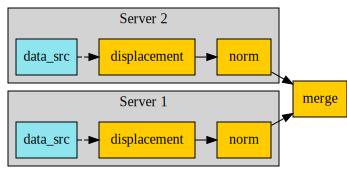

.. DO NOT EDIT.
.. THIS FILE WAS AUTOMATICALLY GENERATED BY SPHINX-GALLERY.
.. TO MAKE CHANGES, EDIT THE SOURCE PYTHON FILE:
.. "examples\06-distributed-post\00-distributed_total_disp.py"
.. LINE NUMBERS ARE GIVEN BELOW.

.. only:: html

    .. note::
        :class: sphx-glr-download-link-note

        Click :ref:`here <sphx_glr_download_examples_06-distributed-post_00-distributed_total_disp.py>`
        to download the full example code

.. rst-class:: sphx-glr-example-title

.. _sphx_glr_examples_06-distributed-post_00-distributed_total_disp.py:

.. _ref_distributed_total_disp:

Postprocessing of displacement on distributed processes
~~~~~~~~~~~~~~~~~~~~~~~~~~~~~~~~~~~~~~~~~~~~~~~~~~~~~~~

This diagram helps you to understand this example. It shows
the operator chain that is used to compute the final result.

.. GENERATED FROM PYTHON SOURCE LINES 16-17

Import the ``dpf-core`` module and its examples files.

.. GENERATED FROM PYTHON SOURCE LINES 17-22

.. code-block:: default

    from ansys.dpf import core as dpf
    from ansys.dpf.core import examples
    from ansys.dpf.core import operators as ops

.. GENERATED FROM PYTHON SOURCE LINES 23-33

Configure the servers.
Make a list of IP addresses and port numbers that DPF servers start and
listen on. Operator instances are created on each of these servers so that
each can address a different result file.

This example postprocesses an analysis distributed in two files.
Consequently, it require two remote processes.

To make it easier, this example starts local servers. However, you can
connect to any existing servers on your network.

.. GENERATED FROM PYTHON SOURCE LINES 33-47

.. code-block:: default

    global_server = dpf.start_local_server(
        as_global=True, config=dpf.AvailableServerConfigs.InProcessServer
    )

    remote_servers = [
        dpf.start_local_server(
            as_global=False, config=dpf.AvailableServerConfigs.GrpcServer),
        dpf.start_local_server(
            as_global=False, config=dpf.AvailableServerConfigs.GrpcServer),
    ]
    ips = [remote_server.ip for remote_server in remote_servers]
    ports = [remote_server.port for remote_server in remote_servers]

.. GENERATED FROM PYTHON SOURCE LINES 48-49

Print the IP addresses and ports.

.. GENERATED FROM PYTHON SOURCE LINES 49-52

.. code-block:: default

    print("ips:", ips)
    print("ports:", ports)

.. rst-class:: sphx-glr-script-out

 .. code-block:: none

    ips: ['127.0.0.1', '127.0.0.1']
    ports: [50055, 50056]

.. GENERATED FROM PYTHON SOURCE LINES 53-54

Send files to the temporary directory if they are not in shared memory.

.. GENERATED FROM PYTHON SOURCE LINES 54-58

.. code-block:: default

    files = examples.download_distributed_files()
    server_file_paths = [dpf.upload_file_in_tmp_folder(files[0], server=remote_servers[0]),
                         dpf.upload_file_in_tmp_folder(files[1], server=remote_servers[1])]

.. GENERATED FROM PYTHON SOURCE LINES 59-63

Create operators on each server
~~~~~~~~~~~~~~~~~~~~~~~~~~~~~~~
On each server, create two operators, one for displacement computations
and one for norm computations. Define their data sources:

.. GENERATED FROM PYTHON SOURCE LINES 63-77

.. code-block:: default

    # - The displacement operator receives data from the data file in its respective
    #   server.
    # - The norm operator, which is chained to the displacement operator, receives
    #   input from the output of the displacement operator.
    #
    remote_operators = []
    for i, server in enumerate(remote_servers):
        displacement = ops.result.displacement(server=server)
        norm = ops.math.norm_fc(displacement, server=server)
        remote_operators.append(norm)
        ds = dpf.DataSources(server_file_paths[i], server=server)
        displacement.inputs.data_sources(ds)

.. GENERATED FROM PYTHON SOURCE LINES 78-81

Create an operator to merge results
~~~~~~~~~~~~~~~~~~~~~~~~~~~~~~~~~~~
Create the ``merge_fields_containers`` operator to merge the results.

.. GENERATED FROM PYTHON SOURCE LINES 81-84

.. code-block:: default

    merge = ops.utility.merge_fields_containers()

.. GENERATED FROM PYTHON SOURCE LINES 85-87

Connect the operators together and get the output
~~~~~~~~~~~~~~~~~~~~~~~~~~~~~~~~~~~~~~~~~~~~~~~~~

.. GENERATED FROM PYTHON SOURCE LINES 87-95

.. code-block:: default

    for i, server in enumerate(remote_servers):
        merge.connect(i, remote_operators[i], 0)

    fc = merge.get_output(0, dpf.types.fields_container)
    print(fc)
    print(fc[0].min().data)
    print(fc[0].max().data)

.. rst-class:: sphx-glr-script-out

 .. code-block:: none

    DPF  Fields Container
      with 1 field(s)
      defined on labels: time 

      with:
      - field 0 {time:  1} with Nodal location, 1 components and 432 entities.

    [0.]
    [10.03242272]

.. rst-class:: sphx-glr-timing

   **Total running time of the script:** ( 0 minutes  0.440 seconds)

.. _sphx_glr_download_examples_06-distributed-post_00-distributed_total_disp.py:

.. only:: html

  .. container:: sphx-glr-footer sphx-glr-footer-example

    .. container:: sphx-glr-download sphx-glr-download-python

      :download:`Download Python source code: 00-distributed_total_disp.py <00-distributed_total_disp.py>`

    .. container:: sphx-glr-download sphx-glr-download-jupyter

      :download:`Download Jupyter notebook: 00-distributed_total_disp.ipynb <00-distributed_total_disp.ipynb>`

.. only:: html

 .. rst-class:: sphx-glr-signature

    `Gallery generated by Sphinx-Gallery <https://sphinx-gallery.github.io>`_
