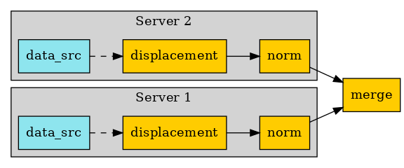

.. DO NOT EDIT.
.. THIS FILE WAS AUTOMATICALLY GENERATED BY SPHINX-GALLERY.
.. TO MAKE CHANGES, EDIT THE SOURCE PYTHON FILE:
.. "examples\06-distributed-post\00-distributed_total_disp.py"
.. LINE NUMBERS ARE GIVEN BELOW.

.. only:: html

    .. note::
        :class: sphx-glr-download-link-note

        Click :ref:`here <sphx_glr_download_examples_06-distributed-post_00-distributed_total_disp.py>`
        to download the full example code

.. rst-class:: sphx-glr-example-title

.. _sphx_glr_examples_06-distributed-post_00-distributed_total_disp.py:

.. _ref_distributed_total_disp:

Distributed post without client connection to remote processes
~~~~~~~~~~~~~~~~~~~~~~~~~~~~~~~~~~~~~~~~~~~~~~~~~~~~~~~~~~~~~~

To help understand this example the following diagram is provided. It shows
the operator chain used to compute the final result.

.. GENERATED FROM PYTHON SOURCE LINES 14-15

Import dpf module and its examples files

.. GENERATED FROM PYTHON SOURCE LINES 15-20

.. code-block:: default

    from ansys.dpf import core as dpf
    from ansys.dpf.core import examples
    from ansys.dpf.core import operators as ops

.. GENERATED FROM PYTHON SOURCE LINES 21-30

Configure the servers
~~~~~~~~~~~~~~~~~~~~~~
Make a list of ip addresses and port numbers on which dpf servers are
started. Operator instances will be created on each of those servers to
address each a different result file.
In this example, we will post process an analysis distributed in 2 files,
we will consequently require 2 remote processes
To make this example easier, we will start local servers here,
but we could get connected to any existing servers on the network.

.. GENERATED FROM PYTHON SOURCE LINES 30-35

.. code-block:: default

    remote_servers = [dpf.start_local_server(as_global=False), dpf.start_local_server(as_global=False)]
    ips = [remote_server.ip for remote_server in remote_servers]
    ports = [remote_server.port for remote_server in remote_servers]

.. GENERATED FROM PYTHON SOURCE LINES 36-37

Print the ips and ports

.. GENERATED FROM PYTHON SOURCE LINES 37-40

.. code-block:: default

    print("ips:", ips)
    print("ports:", ports)

.. rst-class:: sphx-glr-script-out

 Out:

 .. code-block:: none

    ips: ['127.0.0.1', '127.0.0.1']
    ports: [50054, 50055]

.. GENERATED FROM PYTHON SOURCE LINES 41-43

Here we show how we could send files in temporary directory if we were not
in shared memory

.. GENERATED FROM PYTHON SOURCE LINES 43-47

.. code-block:: default

    files = examples.download_distributed_files()
    server_file_paths = [dpf.upload_file_in_tmp_folder(files[0], server=remote_servers[0]),
                         dpf.upload_file_in_tmp_folder(files[1], server=remote_servers[1])]

.. GENERATED FROM PYTHON SOURCE LINES 48-55

Create the operators on the servers
~~~~~~~~~~~~~~~~~~~~~~~~~~
On each server we create two new operators for 'displacement' and 'norm'
computations and define their data sources. The displacement operator
receives data from the data file in its respective server. And the norm
operator, being chained to the displacement operator, receives input from the
output of this one.

.. GENERATED FROM PYTHON SOURCE LINES 55-63

.. code-block:: default

    remote_operators = []
    for i, server in enumerate(remote_servers):
        displacement = ops.result.displacement(server=server)
        norm = ops.math.norm_fc(displacement, server=server)
        remote_operators.append(norm)
        ds = dpf.DataSources(server_file_paths[i], server=server)
        displacement.inputs.data_sources(ds)

.. GENERATED FROM PYTHON SOURCE LINES 64-66

Create a merge_fields_containers operator able to merge the results
~~~~~~~~~~~~~~~~~~~~~~~~~~~~~~~~~~~~~~~~~~~~~~~~~~

.. GENERATED FROM PYTHON SOURCE LINES 66-69

.. code-block:: default

    merge = ops.utility.merge_fields_containers()

.. GENERATED FROM PYTHON SOURCE LINES 70-72

Connect the operators together and get the output
~~~~~~~~~~~~~~~~~~~~~~~~~~~~~~~~~~~~~~~~~~~~~~~~~~

.. GENERATED FROM PYTHON SOURCE LINES 72-80

.. code-block:: default

    for i, server in enumerate(remote_servers):
        merge.connect(i, remote_operators[i], 0)

    fc = merge.get_output(0, dpf.types.fields_container)
    print(fc)
    print(fc[0].min().data)
    print(fc[0].max().data)

.. rst-class:: sphx-glr-script-out

 Out:

 .. code-block:: none

    DPF  Fields Container
      with 1 field(s)
      defined on labels: time 

      with:
      - field 0 {time:  1} with Nodal location, 1 components and 432 entities.

    [0.]
    [10.03242272]

.. rst-class:: sphx-glr-timing

   **Total running time of the script:** ( 0 minutes  0.942 seconds)

.. _sphx_glr_download_examples_06-distributed-post_00-distributed_total_disp.py:

.. only :: html

 .. container:: sphx-glr-footer
    :class: sphx-glr-footer-example

  .. container:: sphx-glr-download sphx-glr-download-python

     :download:`Download Python source code: 00-distributed_total_disp.py <00-distributed_total_disp.py>`

  .. container:: sphx-glr-download sphx-glr-download-jupyter

     :download:`Download Jupyter notebook: 00-distributed_total_disp.ipynb <00-distributed_total_disp.ipynb>`

.. only:: html

 .. rst-class:: sphx-glr-signature

    `Gallery generated by Sphinx-Gallery <https://sphinx-gallery.github.io>`_
