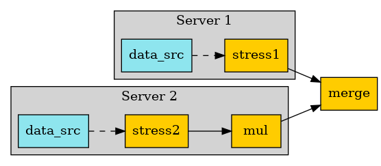

.. DO NOT EDIT.
.. THIS FILE WAS AUTOMATICALLY GENERATED BY SPHINX-GALLERY.
.. TO MAKE CHANGES, EDIT THE SOURCE PYTHON FILE:
.. "examples\06-distributed-post\01-distributed_workflows_on_remote.py"
.. LINE NUMBERS ARE GIVEN BELOW.

.. only:: html

    .. note::
        :class: sphx-glr-download-link-note

        Click :ref:`here <sphx_glr_download_examples_06-distributed-post_01-distributed_workflows_on_remote.py>`
        to download the full example code

.. rst-class:: sphx-glr-example-title

.. _sphx_glr_examples_06-distributed-post_01-distributed_workflows_on_remote.py:

.. _ref_distributed_workflows_on_remote:

Connect operator chains on different processes implicitly
~~~~~~~~~~~~~~~~~~~~~~~~~~~~~~~~~~~~~~~~~~~~~~~~~~~~~~~~~~~~~~~~~~~~~~~
This example shows how distributed files can be read and post processed
on distributed processes. After remote post processing,
results are merged on the local process. In this example, different operator
sequences are directly created on different servers. These operators are then
connected together without having to care that they are on remote processes.

.. GENERATED FROM PYTHON SOURCE LINES 15-16

Import dpf module and its examples files

.. GENERATED FROM PYTHON SOURCE LINES 16-21

.. code-block:: default

    from ansys.dpf import core as dpf
    from ansys.dpf.core import examples
    from ansys.dpf.core import operators as ops

.. GENERATED FROM PYTHON SOURCE LINES 22-26

Configure the servers
~~~~~~~~~~~~~~~~~~~~~~
To make this example easier, we will start local servers here,
but we could get connected to any existing servers on the network.

.. GENERATED FROM PYTHON SOURCE LINES 26-29

.. code-block:: default

    remote_servers = [dpf.start_local_server(as_global=False), dpf.start_local_server(as_global=False)]

.. GENERATED FROM PYTHON SOURCE LINES 30-32

Here we show how we could send files in temporary directory if we were not
in shared memory

.. GENERATED FROM PYTHON SOURCE LINES 32-37

.. code-block:: default

    files = examples.download_distributed_files()
    server_file_paths = [dpf.upload_file_in_tmp_folder(files[0], server=remote_servers[0]),
                         dpf.upload_file_in_tmp_folder(files[1], server=remote_servers[1])]

.. GENERATED FROM PYTHON SOURCE LINES 38-39

First operator chain.

.. GENERATED FROM PYTHON SOURCE LINES 39-47

.. code-block:: default

    remote_operators = []

    stress1 = ops.result.stress(server=remote_servers[0])
    remote_operators.append(stress1)
    ds = dpf.DataSources(server_file_paths[0], server=remote_servers[0])
    stress1.inputs.data_sources(ds)

.. GENERATED FROM PYTHON SOURCE LINES 48-49

Second operator chain.

.. GENERATED FROM PYTHON SOURCE LINES 49-56

.. code-block:: default

    stress2 = ops.result.stress(server=remote_servers[1])
    mul = stress2 * 2.0
    remote_operators.append(mul)
    ds = dpf.DataSources(server_file_paths[1], server=remote_servers[1])
    stress2.inputs.data_sources(ds)

.. GENERATED FROM PYTHON SOURCE LINES 57-58

Local merge operator.

.. GENERATED FROM PYTHON SOURCE LINES 58-61

.. code-block:: default

    merge = ops.utility.merge_fields_containers()

.. GENERATED FROM PYTHON SOURCE LINES 62-64

Connect the operator chains together and get the output
~~~~~~~~~~~~~~~~~~~~~~~~~~~~~~~~~~~~~~~~~~~~~~~~~~

.. GENERATED FROM PYTHON SOURCE LINES 64-73

.. code-block:: default

    nodal = ops.averaging.to_nodal_fc(merge)

    merge.connect(0, remote_operators[0], 0)
    merge.connect(1, remote_operators[1], 0)

    fc = nodal.get_output(0, dpf.types.fields_container)
    print(fc[0])
    fc[0].meshed_region.plot(fc[0])

.. image-sg:: /examples/06-distributed-post/images/sphx_glr_01-distributed_workflows_on_remote_001.png
   :alt: 01 distributed workflows on remote
   :srcset: /examples/06-distributed-post/images/sphx_glr_01-distributed_workflows_on_remote_001.png
   :class: sphx-glr-single-img

.. rst-class:: sphx-glr-script-out

 Out:

 .. code-block:: none

    DPF  Field
      Location: Nodal
      Unit: Pa
      432 entities 
      Data:6 components and 432 elementary data 

.. rst-class:: sphx-glr-timing

   **Total running time of the script:** ( 0 minutes  2.165 seconds)

.. _sphx_glr_download_examples_06-distributed-post_01-distributed_workflows_on_remote.py:

.. only :: html

 .. container:: sphx-glr-footer
    :class: sphx-glr-footer-example

  .. container:: sphx-glr-download sphx-glr-download-python

     :download:`Download Python source code: 01-distributed_workflows_on_remote.py <01-distributed_workflows_on_remote.py>`

  .. container:: sphx-glr-download sphx-glr-download-jupyter

     :download:`Download Jupyter notebook: 01-distributed_workflows_on_remote.ipynb <01-distributed_workflows_on_remote.ipynb>`

.. only:: html

 .. rst-class:: sphx-glr-signature

    `Gallery generated by Sphinx-Gallery <https://sphinx-gallery.github.io>`_
