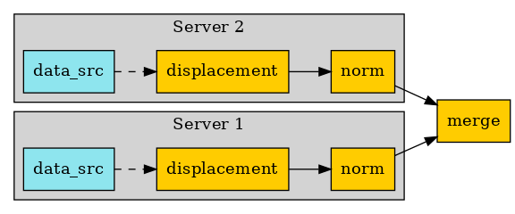

.. DO NOT EDIT.
.. THIS FILE WAS AUTOMATICALLY GENERATED BY SPHINX-GALLERY.
.. TO MAKE CHANGES, EDIT THE SOURCE PYTHON FILE:
.. "examples\06-distributed-post\04-distributed_total_disp_with_operators.py"
.. LINE NUMBERS ARE GIVEN BELOW.

.. only:: html

    .. note::
        :class: sphx-glr-download-link-note

        Click :ref:`here <sphx_glr_download_examples_06-distributed-post_04-distributed_total_disp_with_operators.py>`
        to download the full example code

.. rst-class:: sphx-glr-example-title

.. _sphx_glr_examples_06-distributed-post_04-distributed_total_disp_with_operators.py:

.. _ref_distributed_total_disp_op:

Distributed post without client connection to remote processes with Operators
~~~~~~~~~~~~~~~~~~~~~~~~~~~~~~~~~~~~~~~~~~~~~~~~~~~~~~~~~~~~~~~~~~~~~~~~~~~~~
This example shows how distributed files can be read and post processed
on distributed processes. After remote post processing, results are merged
on the local process.

.. GENERATED FROM PYTHON SOURCE LINES 14-15

Import dpf module and its examples files

.. GENERATED FROM PYTHON SOURCE LINES 15-20

.. code-block:: default

    from ansys.dpf import core as dpf
    from ansys.dpf.core import examples
    from ansys.dpf.core import operators as ops

.. GENERATED FROM PYTHON SOURCE LINES 21-23

Create the template workflow of total displacement
~~~~~~~~~~~~~~~~~~~~~~~~~~~~~~~~~~~~~~~~~~~~~~~~~~~

.. GENERATED FROM PYTHON SOURCE LINES 25-34

Configure the servers
~~~~~~~~~~~~~~~~~~~~~~
Make a list of ip addresses an port numbers on which dpf servers are
started. Workflows instances will be created on each of those servers to
address each a different result file.
In this example, we will post process an analysis distributed in 2 files,
we will consequently require 2 remote processes
To make this example easier, we will start local servers here,
but we could get connected to any existing servers on the network.

.. GENERATED FROM PYTHON SOURCE LINES 34-39

.. code-block:: default

    remote_servers = [dpf.start_local_server(as_global=False), dpf.start_local_server(as_global=False)]
    ips = [remote_server.ip for remote_server in remote_servers]
    ports = [remote_server.port for remote_server in remote_servers]

.. GENERATED FROM PYTHON SOURCE LINES 40-41

Print the ips and ports

.. GENERATED FROM PYTHON SOURCE LINES 41-44

.. code-block:: default

    print("ips:", ips)
    print("ports:", ports)

.. rst-class:: sphx-glr-script-out

 Out:

 .. code-block:: none

    ips: ['127.0.0.1', '127.0.0.1']
    ports: [50054, 50055]

.. GENERATED FROM PYTHON SOURCE LINES 45-47

Here we show how we could send files in temporary directory if we were not
in shared memory

.. GENERATED FROM PYTHON SOURCE LINES 47-51

.. code-block:: default

    files = examples.download_distributed_files()
    server_file_paths = [dpf.upload_file_in_tmp_folder(files[0], server=remote_servers[0]),
                         dpf.upload_file_in_tmp_folder(files[1], server=remote_servers[1])]

.. GENERATED FROM PYTHON SOURCE LINES 52-56

Send workflows on servers
~~~~~~~~~~~~~~~~~~~~~~~~~~
Here we create new instances on the server by copies of the template workflow
We also connect the data sources to those workflows

.. GENERATED FROM PYTHON SOURCE LINES 56-64

.. code-block:: default

    remote_operators = []
    for i, server in enumerate(remote_servers):
        displacement = ops.result.displacement(server=server)
        norm = ops.math.norm_fc(displacement, server=server)
        remote_operators.append(norm)
        ds = dpf.DataSources(server_file_paths[i], server=server)
        displacement.inputs.data_sources(ds)

.. GENERATED FROM PYTHON SOURCE LINES 65-67

Create a local workflow able to merge the results
~~~~~~~~~~~~~~~~~~~~~~~~~~~~~~~~~~~~~~~~~~~~~~~~~~

.. GENERATED FROM PYTHON SOURCE LINES 67-69

.. code-block:: default

    merge = ops.utility.merge_fields_containers()

.. GENERATED FROM PYTHON SOURCE LINES 70-72

Connect the workflows together and get the output
~~~~~~~~~~~~~~~~~~~~~~~~~~~~~~~~~~~~~~~~~~~~~~~~~~

.. GENERATED FROM PYTHON SOURCE LINES 72-80

.. code-block:: default

    for i, server in enumerate(remote_servers):
        merge.connect(i, remote_operators[i], 0)

    fc = merge.get_output(0, dpf.types.fields_container)
    print(fc)
    print(fc[0].min().data)
    print(fc[0].max().data)

.. rst-class:: sphx-glr-script-out

 Out:

 .. code-block:: none

    DPF  Fields Container
      with 1 field(s)
      defined on labels: time 

      with:
      - field 0 {time:  1} with Nodal location, 1 components and 432 entities.

    [0.]
    [10.03242272]

.. rst-class:: sphx-glr-timing

   **Total running time of the script:** ( 0 minutes  1.040 seconds)

.. _sphx_glr_download_examples_06-distributed-post_04-distributed_total_disp_with_operators.py:

.. only :: html

 .. container:: sphx-glr-footer
    :class: sphx-glr-footer-example

  .. container:: sphx-glr-download sphx-glr-download-python

     :download:`Download Python source code: 04-distributed_total_disp_with_operators.py <04-distributed_total_disp_with_operators.py>`

  .. container:: sphx-glr-download sphx-glr-download-jupyter

     :download:`Download Jupyter notebook: 04-distributed_total_disp_with_operators.ipynb <04-distributed_total_disp_with_operators.ipynb>`

.. only:: html

 .. rst-class:: sphx-glr-signature

    `Gallery generated by Sphinx-Gallery <https://sphinx-gallery.github.io>`_
